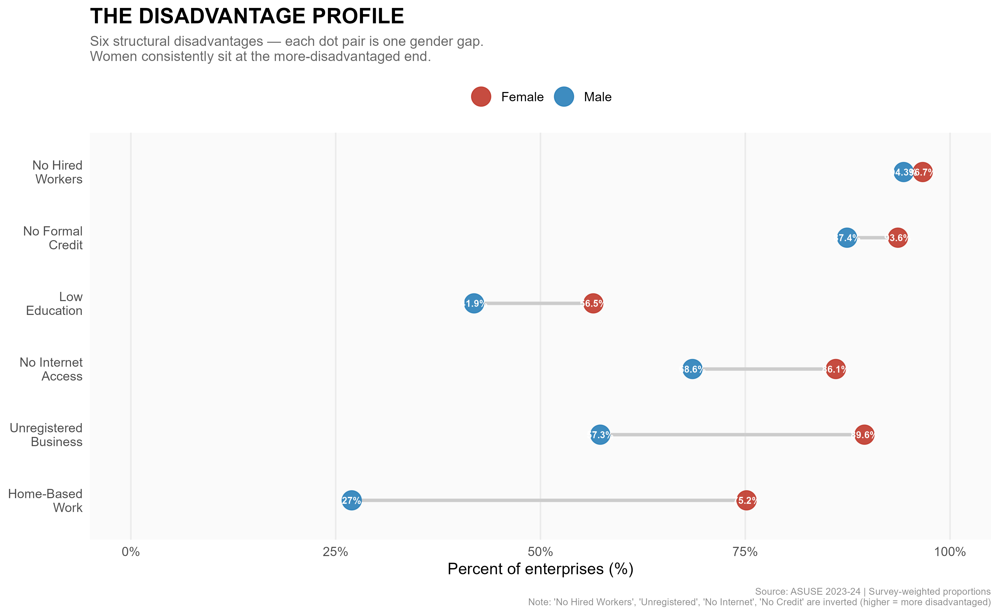
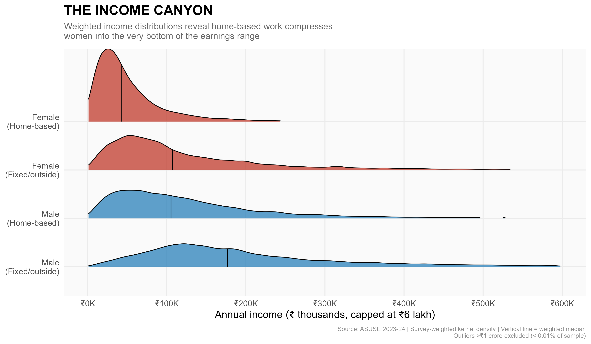
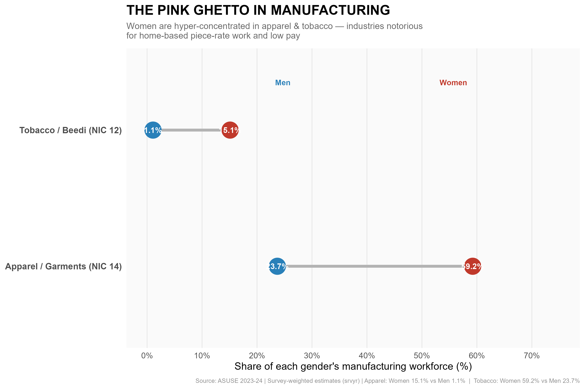
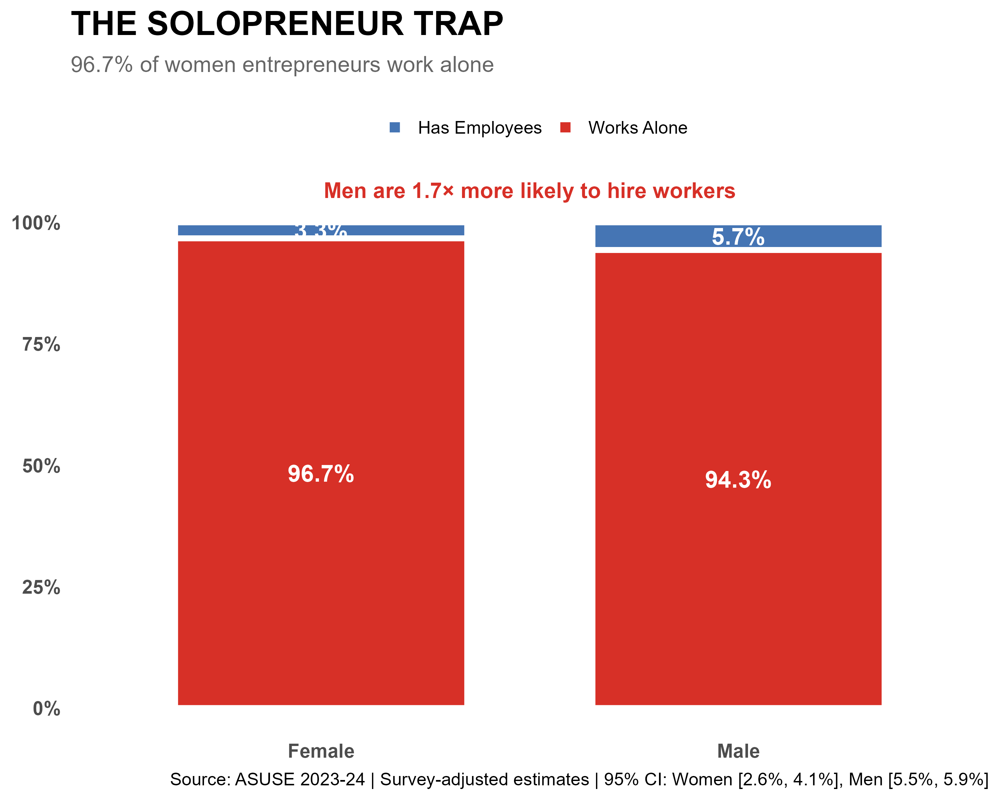
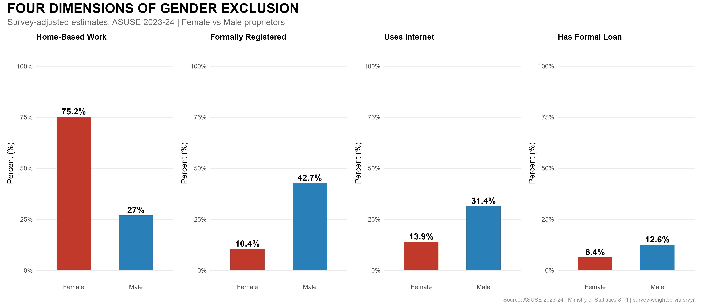
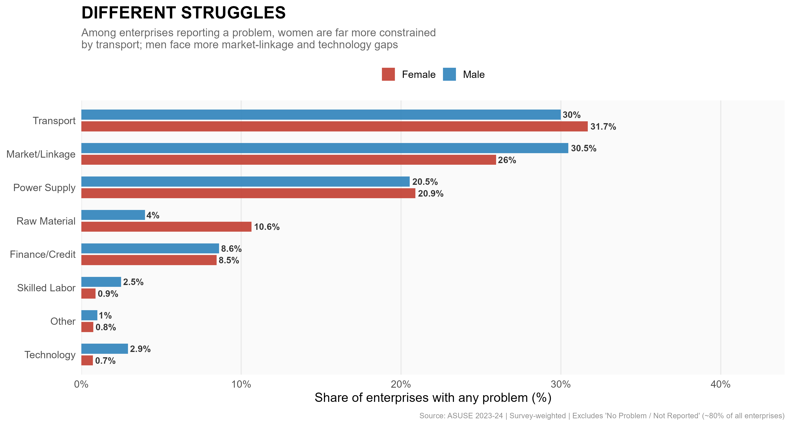
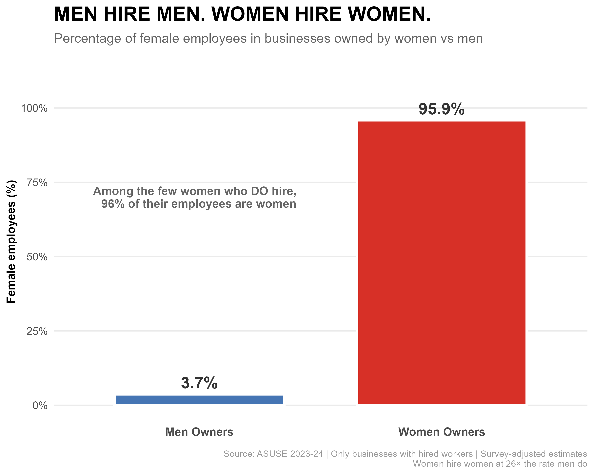

## Abstract

India's unincorporated sector accounts for the majority of non-agricultural employment, yet the entrepreneurial experiences of men and women within it are strikingly asymmetric. Using the Annual Survey of Unincorporated Sector Enterprises (ASUSE) 2023-24—the most comprehensive nationally representative survey of the sector to date—this analysis applies survey-weighted estimation to examine gender gaps across six structural dimensions: enterprise location, sectoral concentration, firm scaling, business formalization, digital access, and credit. The results reveal that women entrepreneurs are systematically confined to home-based, informal, and digitally-excluded enterprises, and face dramatically lower rates of business registration and credit access compared to their male counterparts. Notably, the data also surfaces a counter-narrative: women who successfully scale their enterprises exhibit a strong "Sisterhood Effect," hiring other women at 26 times the rate that male enterprise owners do. These findings have direct implications for the design of inclusive enterprise policy in India.

---

## 1. The Research Problem

India's unincorporated, or informal, enterprise sector is frequently described as the backbone of the economy. It provides livelihoods to hundreds of millions of people and constitutes the bulk of employment outside organized industry. Yet aggregate descriptions of this sector rarely distinguish between the radically different conditions under which men and women operate within it.

The persistent conflation of male and female entrepreneurship under the single umbrella of the "unincorporated sector" masks structural inequalities that conventional policy frameworks are ill-equipped to address. If women entrepreneurs predominantly work from home, operate in two or three narrow industries, cannot register their businesses, cannot access formal credit, and are excluded from the digital economy, then policies designed for a generic "small entrepreneur" will systematically fail half the intended beneficiaries.

This analysis addresses a specific gap in our understanding: **Do women and men in India's unincorporated sector operate under structurally different conditions, and if so, across which dimensions are these gaps most pronounced?** The ASUSE 2023-24 data provides an opportunity to answer this question with nationally representative, survey-adjusted precision for the first time at this scale.

---

## 2. Data and Methodology

### 2.1 Data Source

The primary data source is the **Annual Survey of Unincorporated Sector Enterprises (ASUSE) 2023-24**, conducted by the Ministry of Statistics and Programme Implementation (MoSPI), Government of India. The survey covers unincorporated non-agricultural enterprises across rural and urban India using a stratified multi-stage sampling design. It is released in the form of unit-level microdata across fifteen data blocks (Levels 01–16), each covering a distinct module of enterprise and owner characteristics.

### 2.2 Dataset Construction

The analysis dataset was built in R by merging seven of the fifteen ASUSE data blocks:

| Block | Content |
|---|---|
| Block 01 (Level 01) | Sampling weights (`mlt`) and primary sampling units |
| Block 02 (Level 02) | Core establishment characteristics, NIC industry codes, digital access, registration, and location |
| Block 07 (Level 07) | Loan and credit data |
| Block 08 (Level 08) | Income and Gross Value Added (GVA) |
| Block 09 (Level 09) | Employment by gender (full-time / part-time, male / female / transgender) |
| Block 10 (Level 10) | Wage and salary payments |
| Block 11 (Level 11) | Fixed assets |

Each block was loaded from SPSS (`.sav`) format using R's `haven` package, then column names were standardized using `janitor::clean_names()`. Unique establishment identifiers were constructed by concatenating four hierarchical fields: `fsu_serial_no`, `segment_no`, `second_stage_stratum_no`, and `sample_est_no`. An important data inconsistency was detected and corrected: Blocks 08, 09, and 10 use the field name `second_stage_stratum` (without the `_no` suffix), requiring separate identifier strings for each join—a mismatch that would have caused near-total income and employment data loss had it gone undetected.

The merged dataset was restricted to **proprietary establishments** (sole ownership), retaining only enterprises owned by male, female, or transgender individuals (NIC `ownership_type` codes 1, 2, and 3). Partnerships and institutional owners were excluded to ensure the gender-of-owner variable was unambiguous.

### 2.3 Variable Construction

The following analysis variables were derived from the raw item codes:

- **Work Location** — Item 214 from Block 02 (`location` field). Coded as *Home-Based (Invisible)* for code `1`, and other categories for codes `2`–`5`.
- **Registration Status** — Item 223 from Block 02 (`registered` field). Classified as *Formal (Registered)* for code `1` and *Informal (Unregistered)* for code `2`.
- **Internet Use** — `used_internet` field from Block 02. Binary Yes/No.
- **NIC Industry Codes** — `major_nic_2dig` and `major_nic_5dig` from Block 02. Two-digit codes were used to identify Apparel (NIC 14) and Tobacco/Beedi (NIC 12) sectors.
- **Broad Sector** — Derived from two-digit NIC: Manufacturing (10–33), Trade (45–47), Services (36–39, 50–96).
- **Income** — Sum of GVA items 769 and 779 from Block 08 (`value_rs`), covering the last 30-day reference period, annualized by multiplying by 12.
- **Employer Status** — Defined as any establishment with `Total_Hired_Workers > 0`, where hired workers were summed from full-time and part-time male, female, and transgender columns in Block 09.
- **Female Hiring Ratio** — `Female_Hired_Workers / Total_Hired_Workers × 100`, computed for enterprises with at least one hired worker.
- **Credit Access** — Binary indicator: any establishment with `Total_Loans > 0` from Block 07.

**Data quality filters applied:**
- Income outliers removed: only establishments with `0 < Income ≤ ₹1 crore` retained.
- Asset outliers removed: `Total_Assets ≤ ₹5 crore`.
- Loan outliers removed: `Total_Loans ≤ ₹1 crore`.
- Establishments with missing sampling weights excluded from all survey estimates.

### 2.4 Survey-Weighted Estimation

All reported estimates use full survey-adjusted inference. The **`survey`** package in R was used to instantiate a stratified cluster design object (`svydesign()`) using:

- **Primary Sampling Units (PSUs):** `fsu_serial_no`
- **Stratification:** `second_stage_stratum_no` (where available from Block 01)
- **Weights:** The `mlt` (multiplier) field from Block 01, which expands the sample to national population totals

Point estimates for proportions were computed using `svyby(~ indicator, ~ Gender, design, svymean)`, with 95% confidence intervals derived from standard errors (`± 1.96 × SE`). The `survey.lonely.psu` option was set to `"adjust"` to handle strata with a single PSU, using a conservative adjustment that adds no bias but ensures variance computability.

All charts annotate their survey-adjusted estimates alongside confidence intervals, making the precision of each claim explicit.

---

## 3. Results

### Finding 1 — The Invisible Workshop & The Income Canyon

The most fundamental structural difference between male and female entrepreneurs is where they work. **75.2% of women entrepreneurs operate from within their homes**, compared to just 27% of men. This nearly three-fold gap is not incidental—it reflects a constrained set of choices shaped by mobility restrictions, caregiving responsibilities, and capital limitations. 

Crucially, this spatial isolation has a direct impact on earning potential. As the income distribution ridge plot below demonstrates, home-based work severely compresses women's incomes into the very bottom of the earnings range, creating an "Income Canyon" between them and their male counterparts who operate out of fixed, external premises.

### Finding 2 — The Pink Ghetto in Manufacturing

Among women in the manufacturing sector, the diversity of options is strikingly narrow. The dumbbell chart reveals a hyper-concentration in just two industries.

**59% of women in manufacturing work in Apparel and Garments (NIC 14)**, and a further **15% in Tobacco products, primarily Beedi rolling (NIC 12)**. By contrast, men are distributed much more evenly across the manufacturing spectrum. These two female-dominated industries are characterized by low entry barriers, minimal capital requirements, piece-rate pay structures, and very thin margins. This concentration is not an expression of comparative advantage—it reflects the pinch of intersecting constraints that funnel women into the same narrow corridors.

### Finding 3 — The Solopreneur Trap

Scaling an enterprise—transitioning from running it alone to hiring even one additional worker—is a critical inflection point in firm growth. The ASUSE data reveals that this transition remains overwhelmingly out of reach for women.

**Only 3.3% of women-owned enterprises have any hired workers**, compared to nearly double that rate for men. This gap is not simply a reflection of smaller firm size; it reflects a compounding of constraints. Home-based operations offer little space for additional workers, informality makes it legally risky, and limited credit access prevents payroll expansion. The vast majority of women entrepreneurs remain permanently self-employed—solopreneurs by circumstance rather than choice.

### Finding 4 — Four Dimensions of Exclusion: Formalization, Digital, and Credit

The structural disadvantages women face extend beyond physical space and into the institutional and digital realms. The summary panel below highlights four intersecting dimensions of exclusion.

Women are almost entirely locked out of the formal economy: **90% of women-owned businesses are unregistered** (the "Paper Ceiling"), making them invisible to state support systems and institutional lenders. Consequently, **only 6% of women entrepreneurs have access to formal credit**. This lack of formalization is compounded by a severe digital divide, where **86% of women entrepreneurs operate entirely offline**. Together, these deficits create a self-reinforcing trap: no credit means no ability to scale, no digital presence limits market reach, and no registration disqualifies them from government assistance.

### Finding 5 — Divergent Constraints: Transport vs. Markets

When entrepreneurs are asked about the most severe problem facing their business, a stark gender divergence emerges, highlighting how different their operational realities are.

For women, **Transport** is one of the most disproportionately cited constraints, reflecting the severe mobility restrictions and safety concerns they face when trying to source materials or deliver goods outside the home. For men, the primary hurdles are **Market Linkages** and **Power Supply**—growth-oriented constraints typical of enterprises trying to expand their customer base or run heavy machinery.

### Finding 6 — The Sisterhood Effect

Amidst the severe constraints documented above, the ASUSE data offers a striking counter-narrative regarding the potential impact of women's entrepreneurship.

**When women do scale and hire, they disproportionately employ other women.** Women enterprise owners hire female workers at **26 times the rate** that male enterprise owners do. In fact, 96% of the workforce in female-owned employer firms consists of women. This "Sisterhood Effect" suggests that women-led enterprises function as critical anchors in the female labor market—creating safe, accessible employment opportunities that male-led firms in the same sector are far less likely to generate.

---

## 4. Discussion

The seven findings together do not describe isolated disadvantages—they describe a **self-reinforcing system of exclusion**. A woman who works from home (Finding 1) is concentrated in low-margin sectors (Finding 2), cannot easily hire workers (Finding 3), has little incentive or ability to register (Finding 4), is excluded from digital markets (Finding 6), and cannot access the credit that would otherwise break the cycle (Finding 7).

This system is not an accident of individual circumstance. It reflects structural conditions—social norms around mobility, unequal burden of unpaid care work, capital market discrimination, and the design of state schemes that presuppose formal, fixed-location enterprises—that collectively constrain women's entrepreneurial choices at every stage.

What makes the Sisterhood Effect (Finding 5) particularly valuable from a policy perspective is that it demonstrates the *multiplier* nature of investing in women entrepreneurs. The bottleneck is not women's entrepreneurial capacity—it is their access to resources. Where that access is secured, women create economic opportunities for other women at a scale that male-owned firms do not.

**Implications for policy:**
- **Enterprise support programs** must be re-designed to reach home-based and unregistered enterprises. Requiring a fixed address or registration certificate as a precondition for eligibility systematically excludes 90% of women-owned firms.
- **Digital inclusion initiatives** need to specifically target women micro-entrepreneurs, not just households. Business-purpose internet access and digital financial literacy are distinct interventions from general digital access.
- **Credit delivery mechanisms**—particularly through Self-Help Groups, Mudra Yojana, and PM Vishwakarma—must be evaluated against gendered take-up data, not just aggregate disbursement statistics.
- **Sector diversification** support for women in manufacturing should aim to reduce the double concentration in apparel and tobacco, which functions as both a cause and a consequence of limited alternatives.

---

## 5. Conclusion

The ASUSE 2023-24 data reveals that India's women entrepreneurs do not operate as smaller versions of their male counterparts—they inhabit a structurally distinct segment of the unincorporated economy, shaped by different spaces (the home), different sectors (apparel and tobacco), and different constraints (formalization, credit, and digitization). Closing these gaps is not merely an equity imperative. Given the Sisterhood Effect, it is also an efficient route to expanding women's labor force participation more broadly.

The invisible workshop, it turns out, is hiding both a problem and its partial solution.

---

*Methodology Note: This analysis uses survey-weighted estimates from the ASUSE 2023-24 unit-level microdata, computed using the R `survey` package with a stratified cluster design (PSU: `fsu_serial_no`; strata: `second_stage_stratum_no`; weights: `mlt`). All proportions are derived via `svyby(svymean)` and reported with 95% confidence intervals. Establishments with incomes above ₹1 crore, assets above ₹5 crore, or missing survey weights were excluded prior to estimation. The analysis dataset was constructed by merging Blocks 01, 02, 07, 08, 09, 10, and 11 of the ASUSE microdata on a four-part unique establishment identifier.*
